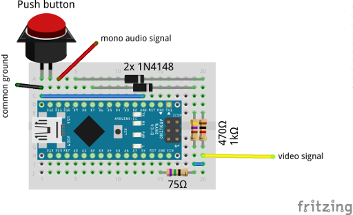

The Mytery of the "Wand"
========================

This is our contribution to the #gppcc9 (Game++ Community Challenge 9) by letsgamedev (which is a german YouTube Channel focused on game making). The contribution video can be found on YouTube: https://www.youtube.com/watch?v=oapEOq833Uo

Hardware
--------

Actually this is a proof of concept, to show that it is possible to build your own video game console using only an arduino board (mainly the basic connectivity of an Atmel ATmega328 / ATmega168 AVR Microcontroller) and a couple of resistors and diodes. The video output is composite video (either PAL or NTSC, chosen in the source code) which is provided by the TVout library by Myles Metzer. The audio output is done via our very own sound engine which controls a PWM output pin. The game controller is only a button connected between the common ground and one GPIO pin.

To build the hardware yourself to play the game, you just have to connect the following (additional to the power supply):

Game
----

The game plays probably in the medieval time and contains magicians and dragons apart from castles, landscapes, hills and caves.
You play a wizard who has a magic wand and has the ability to use this wand to gain supernatural capabilities like to destroy enemies or jump high in the air.

### Gameplay

Start the game pushing the button. Then use the button to swing the wand. Different push sequences result in different actions.

* Press it shortly to jump in the air
* Press it long, then short, to shoot a magic flash against any visible enemy

### Object of the game

Finish all levels. Run through the land and maybe save the world.